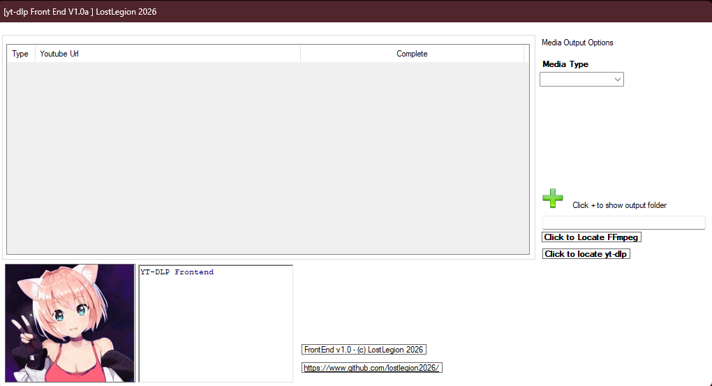
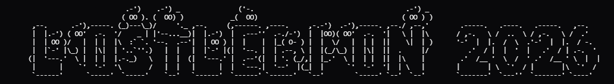

  
# YT-DLP FrontEnd V1.0a [TEST!]

<h1 align="center">
Allows you to Have a list of all the urls's pasted from you tube . 
and saving of media to sub folder's 
Requires .NET v4.81

</h1>



## Installation ##

```command
extract yttool.7z into the folder where you have downloaded yt-dlp.exe
first run 
1 . you will need to provide ffmpeg extraction locations
2 . provide the path for yt-dlp.exe usually same folder as yttool
3 . and the destination folder for the media 
      on providing this path the sub folder's video and music as created
4 . current yt-dlp requires you to have youtube setup in your default browser
    as a cookies.txt will be created in the yt-dlp.exe [folder].

This mod does not require a new game to use so can be added to
the game when you want to.. ;) 
```

If there are any issues <a href="mailto:lostLegion@proton.me?subject=yttool">legionslost@proton.me</a> 
or you can support me <a href="https://buymeacoffee.com/legionslost">  </a>

